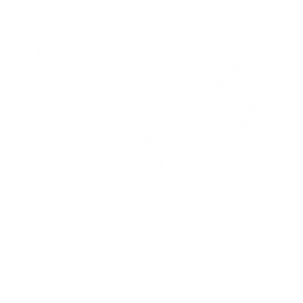
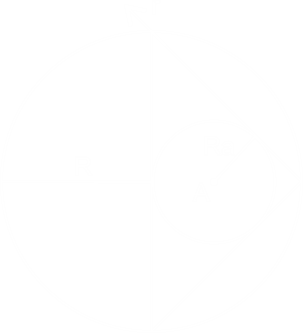

# Questões

1º) Dada uma circunferência \\(\Gamma_1\\) de equação: \\( (x-5)^2+(y-5)^2=4^2 \\) que contém internamente quatro outras circunferências idênticas externas entre si e tangentes a duas outras além da \\(\Gamma_1\\). Determine a equação dessas quatros circunferências. 

2º) Dada a circunferência \\(\Gamma_1\\) de equação: \\( (x-4)^2+(y-2)^2=4^2 \\) que circunscreve um quadrado de lados paralelos aos eixos que contém duas circunferências idênticas de centro pertencente a diagonal de reta: \\(ax+by+c=0, a \\text { e } b > 0\\). Determine a equação dessas circunferências.

3º) Considerando que a circunferência \\(\Gamma\\) de equação \\( (x-5)^2+(y-5)^2=5^2 \\) abaixo se espelha infinitas vezes dentro si como demonstrado, qual será a coordenada da última circunferência? Considere que a figura está rotacionada a \\(\frac{\pi}6\\) radianos no sentido anti-horário.

# Soluções
1º)

(I):  
\\(2R=4r+x \Rightarrow 8 = 4r+x \rightarrow x = 8-4r\\)    

(II):  
\\((2r)^2+(2r)^2 = (2r+x)^2 \Rightarrow 8r^2 = 4r^2+4rx+x^2\\)  
Substituindo por I:  
\\(4r^2 = 4r(8-4r)+(8-4r)^2 \Rightarrow 4r^2=32r-16r^2+64-64r+16r^2\\)  
\\(\Rightarrow r^2+8r-16=0 \Rightarrow r = \frac{-8\pm\sqrt{8^2-4⋅1⋅(-16)}}{2⋅1} \rightarrow r = -4+4\sqrt{2}\\)    

(III):  
\\(A(5+(-4+4\sqrt{2}); 5+(-4+4\sqrt{2}))\\)  
\\(A(1+4\sqrt{2}; 1+4\sqrt{2})\\)  
\\(A: (x-(1+4\sqrt{2}))^2 + (y-(1+4\sqrt{2}))^2 = (-4+4\sqrt{2})^2\\)    

\\(B(5+(-4+4\sqrt{2}); 5-(-4+4\sqrt{2}))\\)  
\\(B(1+4\sqrt{2}; 9-4\sqrt{2})\\)  
\\(B: (x-(1+4\sqrt{2}))^2 + (y-(9-4\sqrt{2}))^2 = (-4+4\sqrt{2})^2\\)    

\\(C(5-(-4+4\sqrt{2}); 5+(-4+4\sqrt{2}))\\)  
\\(C(9-4\sqrt{2}; 1+4\sqrt{2})\\)  
\\(C: (x-(9-4\sqrt{2}))^2 + (y-(1+4\sqrt{2}))^2 = (-4+4\sqrt{2})^2\\)    

\\(D(5-(-4+4\sqrt{2}); 5-(-4+4\sqrt{2}))\\)  
\\(D(9-4\sqrt{2}; 9-4\sqrt{2})\\)  
\\(D: (x-(9-4\sqrt{2}))^2 + (y-(9-4\sqrt{2}))^2 = (-4+4\sqrt{2})^2\\)    

   
2º)

(I):  
\\(2R= 4r+2x \Rightarrow R = 2r+x \rightarrow x = 4-2r\\)    

(II):  
\\(r^2+r^2=(r-x)^2 \Rightarrow 2r^2=r^2+2rx+x^2\\)  
\\(\Rightarrow r^2 = r^2+2r(4-2r)+(4-2r)^2 \Rightarrow r^2=r^2+8r-4r^2+16-16r+4^2\\)  
\\(\Rightarrow r^2+8r-16=0 \Rightarrow r = \frac{-8\pm\sqrt{8^2-4⋅1⋅(-16)}}{2⋅1} = -4+4\sqrt{2}\\)    

(III):  
\\(a^2+a^2=(2R)^2 \Rightarrow a = 4\sqrt{2}\\)    

(IV):  
\\(r: y=2-\frac{4\sqrt{2}}2 \Rightarrow y-2+2\sqrt{2}=0\\)  
\\(s: x = 4+\frac{4\sqrt{2}}2 \Rightarrow x-4-2\sqrt{2}=0\\)  
\\(v: y = 2+\frac{4\sqrt{2}}2 \Rightarrow y -2 - 2\sqrt{2} = 0\\)  
\\(t: x = 4-\frac{4\sqrt{2}}2 \Rightarrow x = 4-2\sqrt{2}=0\\)    

(V):  
\\(d_{A, s} = \frac{\left\vert x-4-2\sqrt{2}\right\vert}{\sqrt{1^2}} = -4+4\sqrt{2}\\)  
\\(x-4-2\sqrt{2}=-4+4\sqrt{2} \Rightarrow x = 6\sqrt{2} > R\\) (I)  
\\(x-4-2\sqrt{2}=4-4\sqrt{2} \Rightarrow x = 8-2\sqrt{2}\\) (II)    

\\(d_{A, r} = \frac{\left\vert y-2+2\sqrt{2}\right\vert}{\sqrt{1^2}} = -4+4\sqrt{2}\\)  
\\(y-4+2\sqrt{2}=-4+4\sqrt{2} \Rightarrow y = -2+2\sqrt{2}\\) (I)  
\\(y-4+2\sqrt{2}=4-4\sqrt{2} \Rightarrow y = 6-6\sqrt{2} < 0\\) (II)    

\\(d_{B v} = \frac{\left\vert y-2-2\sqrt{2}\right\vert}{\sqrt{1^2}} = -4+4\sqrt{2}\\)  
\\(y-2-2\sqrt{2}=-4+4\sqrt{2} \Rightarrow y = -2+6\sqrt{2} > R\\) (I)  
\\(y-2-2\sqrt{2}=4-4\sqrt{2} \Rightarrow y = 6-2\sqrt{2}\\) (II)    

\\(d_{B, t} = \frac{\left\vert x-4+2\sqrt{2}\right\vert}{\sqrt{1^2}} = -4+4\sqrt{2}\\)  
\\(x-4+2\sqrt{2}=-4+4\sqrt{2} \Rightarrow x = 2\sqrt{2}\\) (I)  
\\(x-4+2\sqrt{2}=4-4\sqrt{2} \Rightarrow x = 8-6\sqrt{2} < 0\\) (II)    

(V):  
A: \\( (x-(8-2\sqrt{2}))^2 + (y-(-2+2\sqrt{2}))^2 = (-4+4\sqrt{2})^2 \\)  
B: \\( (x-2\sqrt{2})^2 + (y-(6-2\sqrt{2})^2) = (-4+4\sqrt{2})^2 \\)

3º)  
Primeiro deve-se analisar a circunferência que irá ser espelhada (obs: seu centro coincide com o centro do plano e a mesma não possui rotação, pois não irá influenciar na solução e facilita os cálculos):

Observe que dado um \\(R\\) qualquer, conseguimos encontrar a equação da reta \\(r\\) e portanto conseguimos encontrar \\(R_A\\) utilizando da distância entre ponto e reta:    

(I):  
\\(m_r = \frac{0-R}{R-0} = -1\\)  
\\(r: y-0=-1(x-R) \Rightarrow y+x-R=0\\)    

(II):  
\\(A\left(R_A,0\right)\\)  
\\(d_{A, r} = R_A = \frac{\left\vert R_A+0-R \right\vert}{\sqrt{1^2+1^2}} \Rightarrow R_A\sqrt{2} = \left\vert R_A-R \right\vert\\)  
(I) \\(R_A\sqrt{2} = R_A-R \Rightarrow R_A(\sqrt{2}-1) = -R \Rightarrow R_A = \frac{-R}{\sqrt{2}-1} \lt 0\\)  
(II) \\(-R_A\sqrt{2} = R_A-R \Rightarrow R_A(\sqrt{2}+1)=R \Rightarrow R_A = \frac{R}{\sqrt{2}+1} = \frac{R(\sqrt{2}-1)}{2-1} = R(\sqrt{2}-1)\\)    

Conclui-se, portanto, que dado um \\(R\\) qualquer, o raio da circunferência interna será \\(R(\sqrt{2}-1)\\):  
\\(A_1 = R\\)  
\\(A_2 = R(\sqrt{2}-1)\\)  
\\(A_3 = (R(\sqrt{2}-1))(\sqrt{2}-1) = R(\sqrt{2}-1)^2\\)  
\\(A_n = (R(\sqrt{2}-1)^{n-1})(\sqrt{2}-1) = R(\sqrt{2}-1)^n\\)    

(III):  
\\(d_{O, C} = \sum_{i=1}^{\infty}A_i = \frac{A_1}{1-q}\\) (Soma dos termos de uma PG)  
\\(q = \frac{A_2}{A_1} = \frac{R(\sqrt{2}-1)}{R} = \sqrt{2}-1\\)  
\\(\therefore d_{O, C} = \frac{R}{1-(\sqrt{2}-1)} = \frac{R}{2-\sqrt{2}} = \frac{R(2+\sqrt{2})}{4-2} = \frac{R(2+\sqrt{2})}2\\)    

(IV):  
A partir do uso do de funções trigonométricas de \\(\frac{\pi}6\\) podemos obter a diferença em relação ao centro de \\(\Gamma\\) e somar com o raio para obtermos as coordenadas do centro \\(C\\):    

\\(x = \frac{R(2+\sqrt{2})}2⋅\sin{\left(\frac{\pi}6\right)}+5 = \frac{R(2+\sqrt{2})}2⋅\frac12 = \frac{5(2+\sqrt{2})}4+5\\)
\\(y = \frac{R(2+\sqrt{2})}2⋅\cos{\left(\frac{\pi}6\right)}+5 = \frac{R(2+\sqrt{2})}2⋅\frac{\sqrt{3}}2 = \frac{5\sqrt{3}(2+\sqrt{2})}4+5\\)
\\(\therefore C\left( \frac{5(2+\sqrt{2})}4+5, \frac{5\sqrt{3}(2+\sqrt{2})}4+5 \right)\\)

