# Geometria Analítica

## Circunfêrencia

### Definição:
&nbsp;&nbsp;Uma circunferência é o conjunto de pontos equidistantes a um ponto \\(O(a, b)\\) (chamado de centro) de raio \\(r\\), ou seja:  
\\[ \sqrt{(x-a)^2+(y-b)^2} = r \Leftrightarrow (x-a)^2 + (y-b)^2 = r^2 \\]

    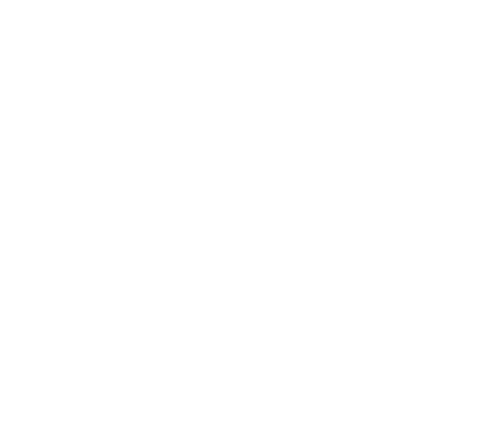

### Equação Geral:
Ao se desenvolver a equação \\( (x-a)^2 + (y-b)^2 = r^2 \\) temos:  
\\[ x^2-2ax+a^2 + y^2-2by+b^2 = r^2 \Leftrightarrow x^2+y^2-2ax-2by+(a^2+b^2-r^2) = 0 \\]
Em alguns casos a equação da circunferência será dada na forma geral sendo complicado identificar o centro e o raio da mesma, com isso será necessário utilizar o método de completar quadrado para tal. Observe:
\\[ x²+y²-2x+4y-4=0 \\]
Primeiro agrupemos os valores em termos de \\(x\\) e de \\(y\\) respectivamente, isolando termos independentes e adicionando dois valores, \\(a\\) e \\(b\\) que irá servir para completar os quadrados:
\\[ x^2-2x+a + y^2-4y+b = 4 \\]
Lembre-se que o valor do "meio" de um produto notável \\((c-d)^2\\) é \\(-2cd\\), note que em nosso caso \\(c=x\\), portanto temos que:
\\[ -2x = -2xa \Rightarrow a = 1\\]
\\[ -4y = -2yb \Rightarrow b = 2\\]
Para mantermos a igualdade devemos somar \\(a^2\\) e \\(b^2\\) ao lado direito da equação:
\\[ x^2-2x+1^2 + y^2-4y+2^2 = 4+1^2+2^2\\]
Conclui-se que a equação da cincunferência será dada por:
\\[ (x-1)^2 + (y-2)^2 = 3^2\\]
Que possui centro \\(O(1, 2)\\) e raio \\(3\\).

### Posições Relativas entre Reta e Circunferência:
Existem três possíveis casos para a posição de uma reta em relação a uma circunfêrencia:  
- 1º) A reta é secante à circunferência, ou seja \\(d_{O, r} \lt r \\)  

    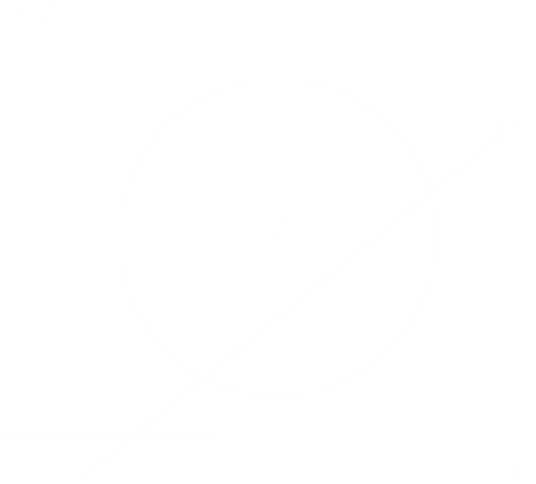

- 2º) A reta é tangente à circunferência, ou seja \\(d_{O, r} = r\\)  

    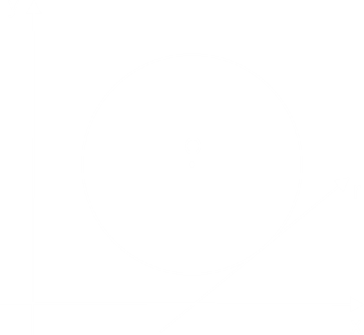

- 3º) A reta é externa à circunferência, ou seja \\(d_{O, r} \gt r\\)  

    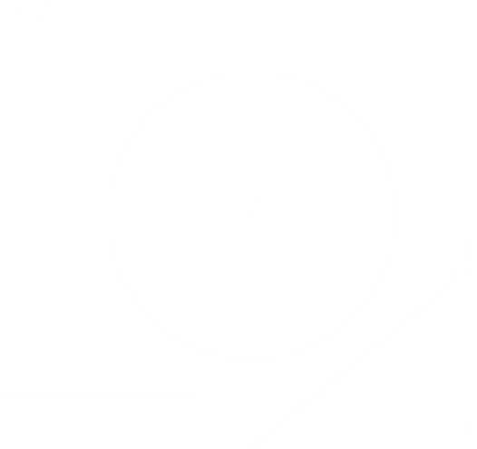

### Posições Relativas entre Circunferências
Existem quatro possíveis casos para a posição entre duas circunferências.
- 1º) Externa, ou seja: \\( d_{O_1, O_2} \gt R_{O_1} + R_{O_2}\\)

    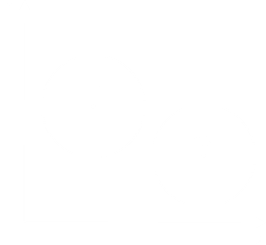

- 2º) Tangente externa, ou seja \\(d_{O_1, O_2} = R_{O_1} + R_{O_2}\\)

    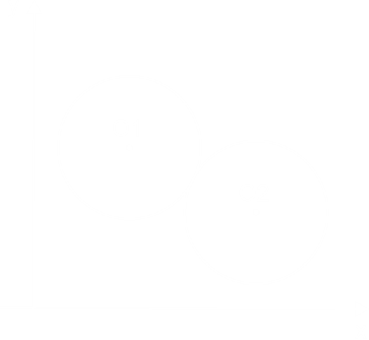

- 3º) Tangente interna, ou seja \\(d_{O_1, O_2} = \vert R_{O_1}-R_{O_2} \vert \\)

    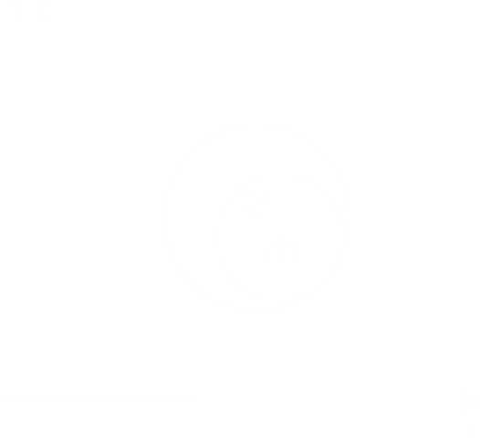

- 4º) Secante, ou seja \\( \vert R_{O_1}-R_{O_2} \vert \lt d_{O_1, O_2} \lt R_{O_1} + R_{O_2}\\)

    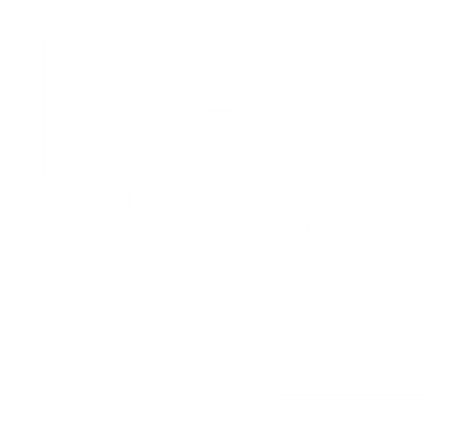

- 5º) Interna, ou seja \\( d_{O_1, O_2} \lt \vert R_{O_1}-R_{O_2} \vert \\)

    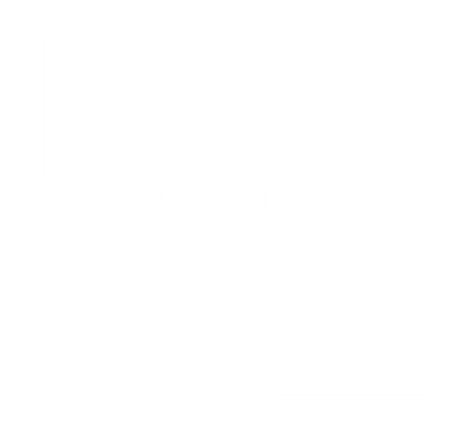

- 6º) Cocêntrica, ou seja \\( O_1 \equiv O_2 \\), \\(d_{O_1, O_2} = 0\\)

    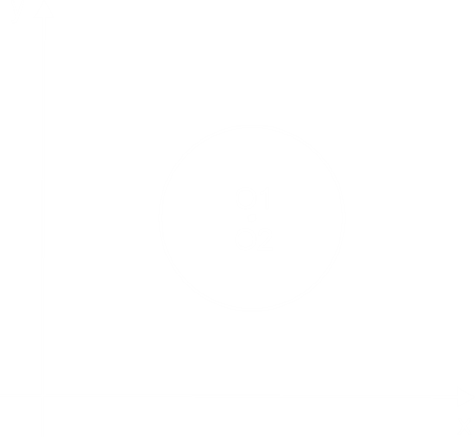

### Coeficiente Angular da Reta Tangente à Circunferência:
O coeficiente angular da reta tangente à um ponto \\( P(P_x, P_y) \\) da circunferência \\( (x-a)^2 + (y-b)^2 = r^2 \\) é dado por:
\\[ m = \frac{a-P_x}{b-P_y} \\]
Para chegar à essa fórmula podemos pensar que a reta tangente à circunferência é a reta perpendicular à reta que passa pelo centro da circunferência e o ponto \\(P\\), dessa forma:
\\[ m_{\overline{OP}} = \frac{P_x - a}{P_y - b} \\]
\\[ m_t \cdot m_{\overline{OP}} = -1 \Leftrightarrow m_t = -\frac{P_x - a}{P_y - b} = \frac{a - P_x}{b - P_y}\\]

    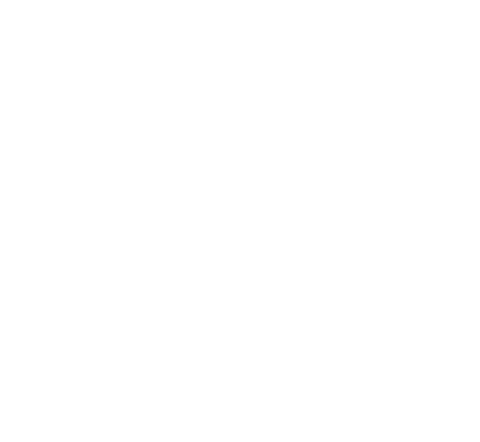

## Elipse

### Definição
É o conjunto de pontos tais que a soma de suas distâncias a dois pontos fixos, \\(F_1\\) e \\(F_2\\), seja constante.

    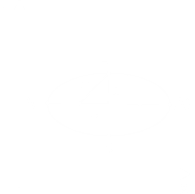

Na figura acima, temos:
- \\(F_1\\) e \\(F_2\\) são os focos da elipse e a distância entre eles é a distância focal (\\(2c\\))
- \\(O(a, b)\\) é o centro da elipse (ponto médio dos focos, do eixo maior e do eixo menor)
- \\(\overline{A_1A_2}\\) é o eixo maior da elipse (\\(2a\\))
- \\(\overline{B_1B_2}\\) é o eixo menor da elipse (\\(2b\\))
- \\(a^2=b^2+c^2\\)

### Excentricidade:
O valor \\(e = \frac{c}{a}\\) ( \\(0 \lt e \lt 1\\) ) chama-se excentricidade, quanto mais próxima de \\(1\\), o seu formato tende a um segmento de reta, quando próximo de \\(0\\) seu formato tende à uma circunferência.

### Equações:
A equação da elipse é dada pela fórmula:
\\[ \frac{(x-O_x)^2}{a^2} + \frac{(y-O_y)^2}{b^2} = 1 \\]

    

Observe que o primeiro denominador corresponde ao eixo horizontal, ou seja, caso a elipse esteja na posição vertical a equação será a seguinte:
\\[ \frac{(x-O_x)^2}{b^2} + \frac{(y-O_y)^2}{a^2} = 1 \\]
